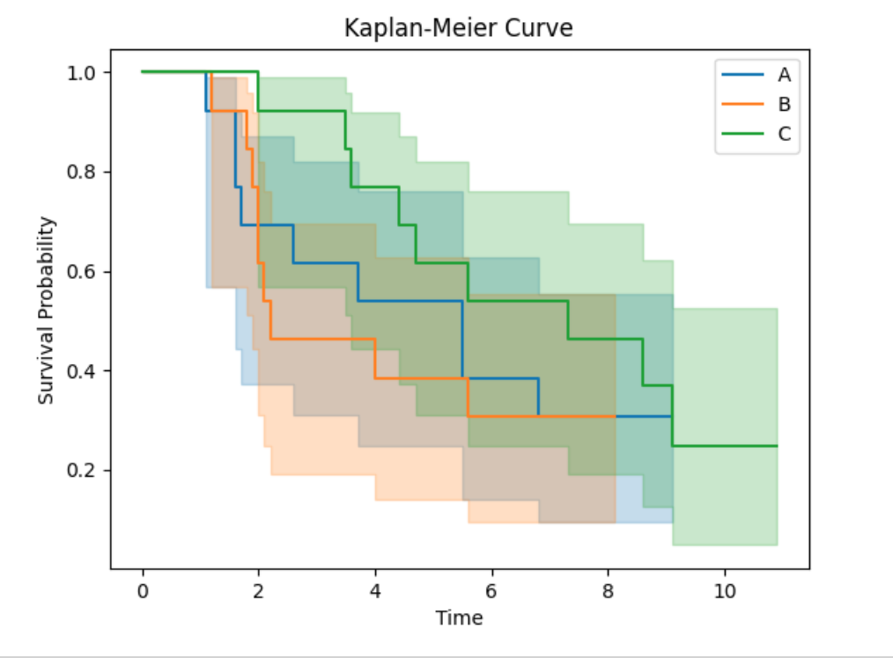
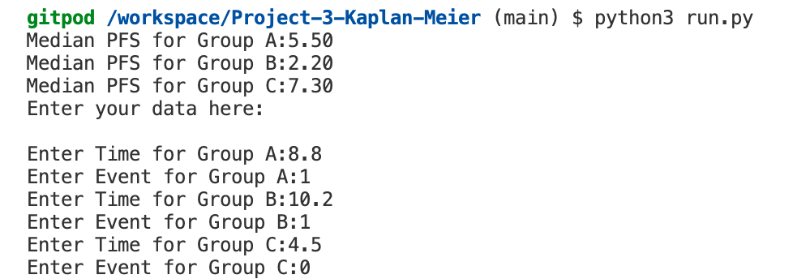

# Project-3-Kaplan-Meier
This project is intended to help clinical scientists, to run a Kaplan-Meier curve for "Progression free survival" for cancer patients in clinical trials.
The problem we are frequently facing, is that we need to rely on statitics and Clincal Research Organizations (CROs) to analyse the data of our patients, whom we treat with certain drugs in clinical trials. This is always very costly and only happens at the very end of the clinical trial, when data are clean. However, it is urgently needed, that one can run such an analysis earlier as well.

Therefore my aim was, with help of Python, to create such a plot, which one can run even on immature data.

I will explain all the terms, which are relevant to understand the data, which are required for such a plot in detail in the next step:

1. Clarification of terms:
* Progression free survival (PFS): 
Unfortunatley patients with certain diseases, like Cancer, have a limited time on their respective treatment, until the tumour starts growing again, because most of the treatments available, can not completely cure the disease. 
Therefore patients are starting on certain treatments, but after a while, their tumour disease starts growing again. 
This is called an "event".

At that timepoint, the current treatment needs to be stopped and the next option of another combination of drugs will be started, again, to achieve a shrinkage of the tumour if possible, which would be called "response". If that happens, the patient will continue on the current treatment, as long as the patient tolerates it.
In this scenario the patient experienced NO "event" means, the tumour did NOT grow

In clinical trials, where new drugs against cancer are tested, this time while the patient receives 1 drug/or a combination of drugs for a certain period of time until the tumour starts growing again, is called PFS or progression free survival (progression is the professional term for "tumour growth").

* mPFS:
In terms of statistics, when a group of patients receives a drug A and another group of patients receives drug B, physician/scientists and statistics are comparing the median time to progression (mPFS) of the tumours of all patients in group A against the growth of the tumours of all the patients in part B. Then the median will be calculated for all the PFS values from patients in group A and from group B and will be compared against each other. The conslusion then will be that drug A works better than drug B. The nest step is then to test of such results can also be achived in a larger patient population (with the same backrgound characterisitcs of their disease) and finally when the results can be confirmed a new drug achieves "Regulatory Approval"  by the FDA/EMEA and or other Health authorities and can then be marketed and therefore be given to all patients with this particular disease.

* Event or no Event:
As explained above, the progression of a tumour in a patient is called "event" and is normally counted as the number "1"
If a patients continues on treatment, because a response to the treatment is achieved, in this occasion this is counted as "NO event" and gets asigned the number zero "0".

### **Kaplan-Meier History**
(https://en.wikipedia.org/wiki/Kaplan%E2%80%93Meier_estimator)

The Kaplan–Meier estimator, also known as the product limit estimator, is a non-parametric statistic used to estimate the survival function from lifetime data. In medical research, it is often used to measure the fraction of patients living for a certain amount of time after treatment. In other fields, Kaplan–Meier estimators may be used to measure the length of time people remain unemployed after a job loss, the time-to-failure of machine parts, or how long fleshy fruits remain on plants before they are removed by frugivores. The estimator is named after Edward L. Kaplan and Paul Meier, who each submitted similar manuscripts to the Journal of the American Statistical Association.[4] The journal editor, John Tukey, convinced them to combine their work into one paper, which has been cited more than 34,000 times since its publication in 1958.

## UX
### **Strategy**

Considering the core UX principles I first started to think about the strategy for this Kaplan-Meier project and defined who the target users would be and what features/technologies they would want.

The Kaplan-Meier users are:

* People > 18 years old
* Biotech and Pharmaceutical Industry and Clinical Research employees and employers
* People interested in medical data analysis

It is not easy, to create a Kapan-Meier curve and there is currently nobody in this field of clinical research, beside organizations with stats departments, who would be able to run such a analysis and they do not do that on an ongoing basis. 
The reason why this is important, is, that companies in drug development need to do long term planning for the next steps to be taken, in case the mPFS data would look promising for one of the arms for example. There is a lot of work required to prepare for these next steps.
Therefore, if one could have an ongoing analysis of evolving data, even if they may be not yet statistically robust, it would be very helpful to at least understand the trend, how the data are developing.

### **Structure**
My Kaplan-Meier program allows exactly this ongoiing data analysis:
The program provides the following steps:

The program is designed to initially, retrieve data from a Google sheet, plot the Kaplan-Meier plot from these data and calculate the mPFS as a 1st step.

The Google sheet contains the following data structure:
- 4 columns: Group, Group-Value, Time, Event
    - the Group column contains data for 3 groups of patients: A, B, and C
        - each group contains 13 rows (each row containing data for one patient: 13 patients in Group A, 13 in group B and 13 in Group C)
    - The Group-Value column provides a numerical number for each of the groups:
        - Group A = Group Value 1
        - Group B = Group Value 2
        - Group C = Group Value 3
    - The "Time" column contains all the times, a single patient (each row of the groups) is on treatment or has been on treatment
    - The "Event" column contains the events:
        - if a patient has had already a progression event  and stopped treatment (value =1) or 
        - is still on treatment, which means this patient had no progression event yet (value =0)

The result of part 1 of the code is:
- The calculation of median PFS, which will be seen in the terminal followed by a prompt for the user, now to enter new data:
Median PFS for Group A:8.80 (these numbers are examples from one of my runs)
Median PFS for Group B:4.00
Median PFS for Group C:7.30
Enter your data here: 

- The Kaplan-Meier plot:

In the 2nd step, particulariy designed for this challenge, the user can enter new data directly into the terminal:
- for "Time" the user can enter numbers between 0-15 and 
- for "Events" either 1 or 0

The user is prompted to enter 13 value pairs for group A, for group B and for group C. 

If the user enters something else, a warning pops up, to enter the correct data. 

Then finally, the new data entered by the user would be up-loaded back into the google sheet and the previous numbers would be replaced by new data.
After that step, the program can be restarted and a new plot with the new data would be created.

Therefore the program follows the following steps:

#### **Part 1 of the code to draw a Kaplan-Meier curve from the existing data in the Google sheet and calculated mPFS** 
- Function to retrieve data from the Google Excelsheet
- Load the data from the Google Excel sheet into a DataFrame
- Function to plot the Kaplan-Meier curve
- Call the plot_kaplan_meier_curve function with the loaded data
- Split the data by groups
- Create a new figure
- Plot seperate curves for each group
- set labels and title for the plot
- display legend
- save and display the plot
    - Convert 'Time' and 'Event' columns to numeric types if needed
    - Drop rows with missing values
- Function to calculate the median PFS for each group
- Calculate mPFS for each group
- print the result

#### **2nd part of the code to enable the user to enter new data, re-plot the Kaplan-Meier curve with new data and feed the new data back into the Google sheet**

- Prompt user for new data input
- Validation of user input (valid data for "time" 0-15 with max.1 decimal place and "event" valid data either 0 or 1)
- Replace existing data with new user input for all rows:
- Update the data in the appropriate index range
- up-date the Google Excel sheet with the modified data

### **Features**
In order to achieve these task, the following libraries and packages have been imported:

- import numpy as np
- import pandas as pd
- from lifelines import KaplanMeierFitter
- from lifelines.statistics import logrank_test
- from lifelines.plotting import add_at_risk_counts
- import matplotlib.pyplot as plt
- import openpyxl
- import gspread
- from google.oauth2.service_account import Credentials

The Google spreadsheet has been created under my google account:
(https://docs.google.com/spreadsheets/d/1qxd4Mb-30sNThwT4Hs2rlcjlBTHtDHV4y9sqhsIFF8g/edit#gid=1921903409)

## Deployment

I deployed this project by using Heroku according to the CI instructions and the deployment link is available at GitHub
[GitHub deployed page]()

## Credits

I have used the following resource, when I was researching the idea,  if python can achieve such a task and how this Kaplan-Meier project could potentially work. This website below gave me the first overview.

The following websites/articles were used:
(https://hollyemblem.medium.com/kaplan-meier-survival-analysis-in-python-bab1e2f26497)

A great help also was ChatGPT, whenever, I got stuck.

## Further comments:
Unfortunately I ran today into problems, which I could not solve in time, neither with the CI tutor support, nor with the help of ChatGPT.
For unnknown reasons, the data for Group C, when entered by the user, are returning an error message, which I could not resolve.
It looks like the follwoing steps from Part 2 of the code do not seem to work properly
- Update the data in the appropriate index range
- up-date the Google Excel sheet with the modified data
The error message is " Index out of range for Group C"
Every other function works fine.
Part 1 of the code executes fine and the plot is up-dated with data form the Google Sheet, the mPFS is calculated and the user can enter all the data.
Unfortunately, they are then not up-loaded back into the Excel sheet due to this error message.
For my use, I would anyway not enter data into the temrinal I would alwasy up-date the Google Excel sheet directly with my new dt=ata, but I was aware, that the project assessors would require to see user input. The input works fine, only the up-load to the Excel sheet does not.

I have decided to submit this project nevertheless, after discussing the code with my tutor last Thursday and his recommendation was, to submit the project even if I would face problems. He did not know at the time about this problem.

